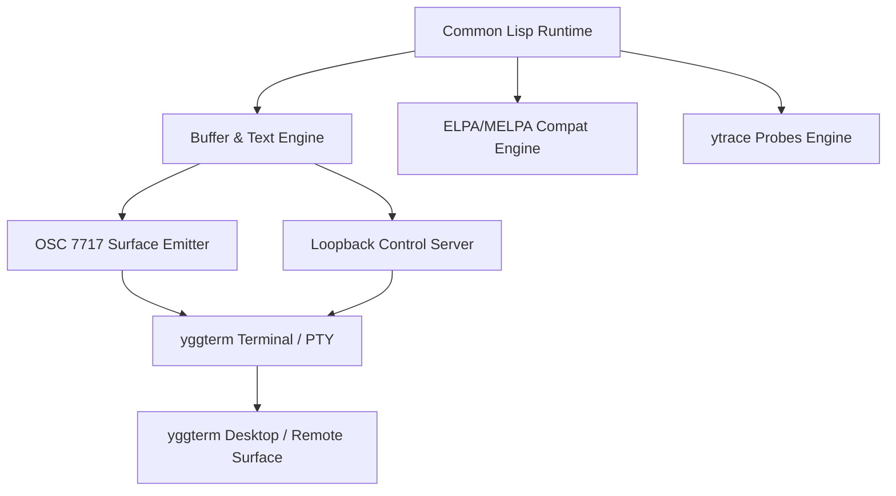

# ymacs Architecture

`ymacs` is designed from the ground up as a high-performance, concurrent, deeply observable editor.

## 1. Structural Layers

1. **Common Lisp Core:**
   - Provides native compiled code execution, true multi-threading, dynamic interactive redefinition, and robust garbage collection.
   - Built for portability across standard Common Lisp implementations (SBCL, ECL).

2. **Buffer & Editing Model:**
   - Employs piecewise rope and gap-buffer algorithms derived from `yedit` and `emd-renderer` for sub-millisecond line indexing and large file manipulation.
   - Decouples buffer data from UI presentation: multiple views/agents can reference the same buffer identity without locking the event loop.

3. **Surface Protocol (libyggterm OSC 7717):**
   - Renders editor panes as libyggterm document surfaces (`"placement": "viewport"`).
   - Renders sidebars as contributed panes (`AppPaneRailBody`) over loopback HTTP control servers.
   - Uses zero custom GUI widgets in yggterm: all UI elements leverage standard yggterm schema widgets (`text-input`, `list-row`, `section`, `tabs`, `footer`).

4. **ytrace Observability:**
   - In-process probes measure mutation overhead, GC cycles, frame layout times, and RPC latency.

